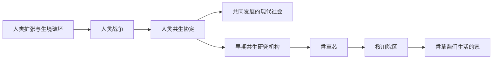

## 一句话

这是一个**科技与魔法同时高度发达**的现代世界。人类与植物精灵曾因生存空间爆发战争，又在漫长历史中把“共同发展”从协定变成了日常。

## 世界基调

- 魔力长久存在于自然环境中，植物精灵等自然魔法生命很早便能感知和使用它。
- 人类约在八百年前的[[world-history|人灵战争]]中首次系统确认魔力的存在。
- 现代魔法拥有完整理论、教育、学术、工程、安全规范与职业资格制度。
- 自然科学与魔法理论彼此交织，共同支撑医疗、能源、材料、生命研究与工程技术。
- 人类与植物精灵如今共享社会制度；植物精灵拥有完整人格、自主权与社会身份。

## 核心主线

## 设定模块

| 主题                  | 内容      |
|---------------------|---------|
| [[world-history     | 历史与共生]] | 人类扩张、人灵战争、共生协定与魔法时代的开始 |
| [[modern-magic      | 现代魔法]]  | 六级体系、工程应用、液态魔力与转换技术 |
| [[plant-spirits     | 植物精灵]]  | 智慧灵植个体的身份、权利、诞生与研究伦理 |
| [[vanilla-core      | 香草芯]]   | 组织起源、发展理念与现代院区网络 |
| [[sakuragawa-campus | 桜川院区]]  | 主舞台、灵植生命研究中心及长期共生生活 |
| [[characters-index  | 香草酱]]   | 芯禾、咲夜与六茶家庭的角色资料 |

## 当前仍待细化

- 人灵战争的具体年代、持续时间与重要战役
- 六级魔法体系的正式等级名称与判定标准
- 现代纪年体系
- 香草芯其他院区的名称与详细方向
- 咲夜的真实过去及部分香草酱的具体诞生过程
