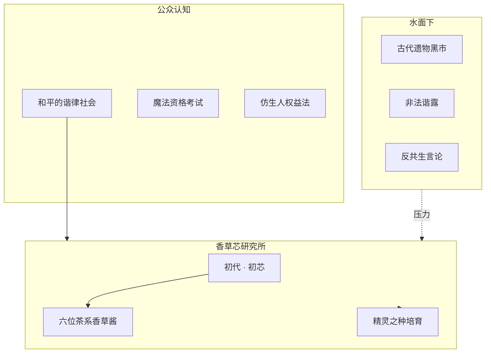

# 世界观总览

## 一句话

在**谐律纪元**，人类与植物精灵共建的文明依靠**谐露**与**灵谐能**运转；表面和平的日常之下，古代遗物、黑市谐露与对「共生秩序」的质疑，正悄然撕开裂痕。

## 世界基调

| 维度   | 描述                                    |
|------|---------------------------------------|
| 表象   | 城市霓虹与魔法路灯并存，新闻里是资格考试改革与仿生人权益，像「真的很和平」 |
| 里层   | 官方沉默回收遗物、研究所之间的资源竞争、地下谐露交易            |
| 情感   | 温暖日常 + 轻悬疑；危机可大可小，由团队后续定调             |
| 与香草酱 | 她们是研究所培育的**植物精灵**，既是技术成果也是活生生的「人」     |

## 设定模块索引

| 文档                                                           | 主题             |
|--------------------------------------------------------------|----------------|
| [01-era.md](01-era.md)                                       | 谐律纪元：历史切片与社会面貌 |
| [02-harmonic-dew.md](02-harmonic-dew.md)                     | 谐露：性质、用途、风险    |
| [03-spirit-harmonic-energy.md](03-spirit-harmonic-energy.md) | 灵谐能：转化与魔科应用    |
| [04-magic-system.md](04-magic-system.md)                     | 魔法学科、考试、咏唱与储存  |
| [05-androids.md](05-androids.md)                             | 人工智能与半灵仿生人     |
| [06-undercurrent.md](06-undercurrent.md)                     | 暗流：势力、悬念与待展开   |
| [07-vanilla-core-institute.md](07-vanilla-core-institute.md) | 香草芯研究所         |

## 香草酱在世界的坐标

## 修订记录

| 版本  | 日期         | 说明   |
|-----|------------|------|
| 0.1 | 2026-05-20 | 初版总览 |
