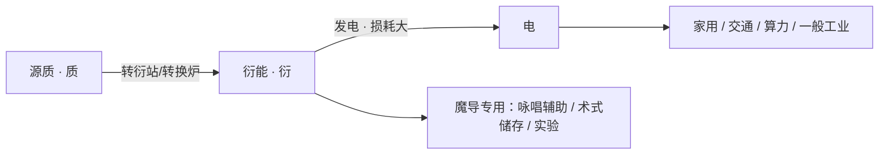

# 衍能与电力

## 定名

**衍能**（Derived Energy）：源质经转换得到的**中间态能量**。源历社会的主线用途是**再转为电能**；仅少量直接进入魔导专用设备。

> 与「源质」成对：**源为体，衍为用**。  
> **口语简称「衍」**——多出现在工厂、研究所、新闻里（「衍断供了」「转衍效率」）；**市民日常谈「电」，不谈衍**。

## 能源链（核心）

| 环节     | 谁在用    | 说明                     |
|--------|--------|------------------------|
| **电**  | 所有人    | 普遍、直接的能源形式；源历社会的「默认语言」 |
| **衍能** | 设施、从业者 | 源质与电之间的桥梁；**主要任务是发电**  |
| **源质** | 工业、科研  | 战略资源；离市民生活较远           |

## 转化效率与「浪费感」

源历的技术现实：

- 源质 → 衍能 → 电 的全链路效率**长期偏低**（设定参考区间 **35%～45%**，随炉体与运维波动）。
- 学界承认：**魔法原理没吃透**，很多环节靠经验参数硬调，损耗被视为「转电损耗」。
- 社会争议：是否继续押注源质电网、是否加大古法直咏唱、是否限制民用电配额——可作日常新闻背景。

非源质电源（水电、余热等）仍占电网一定比例，但源质链是各国的**战略主干**。

## 产生与设施

- **转衍站**：源质精炼 → 衍能。
- **衍能发电机组**：衍能 → 电（公共电力系统核心）。
- **余渣**：低质转换产生「灰衍」污染物。

## 应用分层

| 层级    | 主要用**电**    | 直接涉及**衍能**         |
|-------|-------------|--------------------|
| 民用    | 照明、家电、终端、电车 | 几乎无                |
| 商用    | 工厂、机房、办公    | 魔导产线可能就近接衍能母线      |
| 军用/警用 | 常规装备        | 护盾发生、大型术式阵         |
| 研究    | 一般实验设备      | 精灵孵化、源质活体实验、术式晶片预充 |

## 与魔法的关系

- 魔法**不等同于**衍能；咏唱用的是施法者精神与魔力规则，衍能只是**辅助稳定**或**给设备供能**。
- **机械咏辅助**：市电驱动设备为主，关键节点注入微量衍能。
- **储存术式**：术式晶片需预充衍能（备案管理），不是普通充电宝。

## 香草芯研究所的技术定位

1. 植物精灵—源质共生循环建模；
2. 降低源质在活体内的稳态损耗（间接减轻转电压力）；
3. 六位茶系香草酱的**衍能亲和曲线**（影响魔导实验，不影响她们自己「插电过日子」）。

## 修订记录

| 版本  | 日期         | 说明                     |
|-----|------------|------------------------|
| 0.1 | 2026-05-20 | 灵谐能初版                  |
| 0.2 | 2026-05-20 | 定名衍能                   |
| 0.3 | 2026-05-20 | 衍能主转电；电为日常能源；补充效率与口语分层 |
