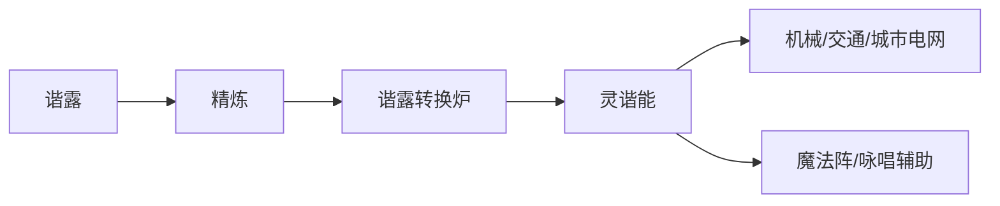

# 灵谐能

## 定名

**灵谐能**（Spirit-Harmonic Energy）：由谐露经转换得到的通用能量形式，既可驱动机械，也可作为魔法咏唱的**媒介与增幅器**。

> 原稿「???」能量体系已定为此名。符号常写作 **SHE** 或汉字「灵谐」。

## 产生方式

- **转换效率**受炉体等级、操作者魔法等级、谐露纯度共同影响。
- **余渣**：低质转换会产生「灰谐」污染物，需专业处理（环保支线可挖）。

## 应用分层

| 层级    | 应用示例                 |
|-------|----------------------|
| 民用    | 家居、终端充电、公共照明         |
| 商用    | 魔导工厂、数据—魔法混合机房       |
| 军用/警用 | 护盾发生装置、魔导警备队装备（公众少见） |
| 研究    | 精灵之种孵化、大型共生实验        |

## 与魔法的关系

- 灵谐能**不能替代**施法者的意志与资格，但可降低咏唱负荷、维持术式稳定。
- **机械咏辅助**：将部分咒文结构固化在设备中，施法者注入精神力 + 微量灵谐能即可触发。
- **储存术式**：预充灵谐能的术式卡/晶片，紧急时即插即用（有等级与术式备案限制）。

## 香草芯研究所的技术定位

研究所在「绿芯计划」中负责：

1. 植物精灵—谐露共生循环的建模；
2. 低损耗谐露在活体精灵体内的稳态方案；
3. 为六位茶系香草酱定制**差异化灵谐能亲和曲线**（影响她们各自擅长领域）。

## 修订记录

| 版本  | 日期         | 说明       |
|-----|------------|----------|
| 0.1 | 2026-05-20 | 灵谐能定名与应用 |
